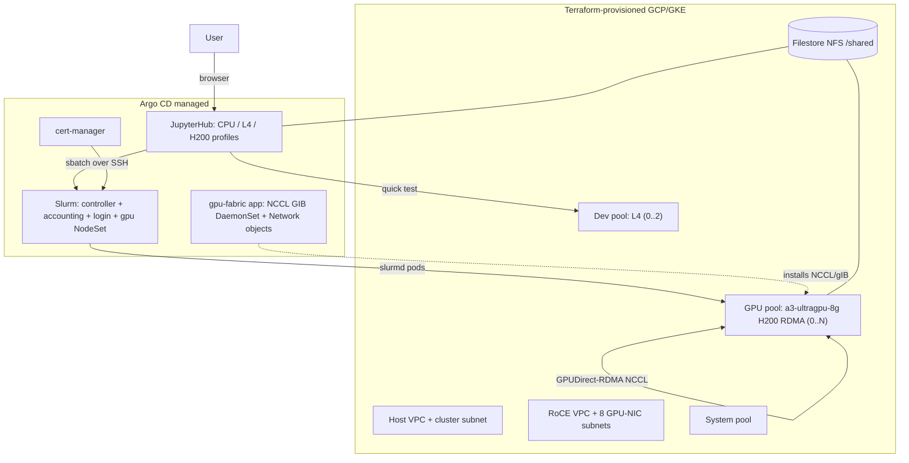

# GKE + Slinky Slurm GPU Training Platform with JupyterLab

A reproducible, mostly one-touch platform for **multi-node training of
VRAM-intensive models** on Google Kubernetes Engine:

- **Terraform** provisions a regional GKE cluster, the GPU **RDMA (RoCE)**
  networking fabric, autoscaling node pools (H200/B200 + cheap L4 dev pool), and
  shared Filestore storage.
- **Slinky (Slurm-on-Kubernetes)** by SchedMD/NVIDIA runs the batch scheduler
  (`sbatch`/`srun`/`squeue`) over **GPUDirect-RDMA** for line-rate NCCL.
- **JupyterHub** gives a dev environment to prototype on a cheap L4 and then
  submit full jobs to the Slurm cluster (shared NFS home, SSH-based submit).
- **Argo CD is the primary deployment path**: Terraform installs Argo CD and
  renders all dynamic manifests + values into `gitops/`; an `ApplicationSet`
  reconciles cert-manager, the Slurm stack, and JupyterHub with sync waves.
  A **Helm-first** path (same Terraform-rendered values) is kept for ad-hoc use.

## Architecture



## Prerequisites

- CLIs: `terraform` (>= 1.6), `gcloud` (+ `gke-gcloud-auth-plugin`), `kubectl`,
  `docker`, and `git`. `helm` (v3.5+) is only required for the Helm-first
  alternative (the Argo path renders charts in-cluster). `make` entry points
  fail fast with a clear message if a tool is missing (`check-%` preflight).
- A GCP project with billing and **H200/B200 capacity** — almost always a
  **reservation** (set `gpu_capacity_mode = "reservation"` + `reservation_name`).
  DWS flex-start and Spot are also supported via `gpu_capacity_mode`.
- Quota for the chosen accelerator in your `zone`.
- Auth for Terraform: on a GCE VM with a service account this is automatic
  (metadata server); otherwise run
  `gcloud auth login && gcloud auth application-default login`.

### Installing the CLIs

**CentOS / RHEL / Rocky:**

```bash
# Terraform (HashiCorp repo)
sudo yum install -y yum-utils
sudo yum-config-manager --add-repo https://rpm.releases.hashicorp.com/RHEL/hashicorp.repo
sudo yum install -y terraform

# gcloud + kubectl + GKE auth plugin (use el8 in baseurl for CentOS/RHEL 8)
sudo tee /etc/yum.repos.d/google-cloud-sdk.repo <<'EOF'
[google-cloud-cli]
name=Google Cloud CLI
baseurl=https://packages.cloud.google.com/yum/repos/cloud-sdk-el9-x86_64
enabled=1
gpgcheck=1
repo_gpgcheck=0
gpgkey=https://packages.cloud.google.com/yum/doc/rpm-package-key.gpg
EOF
sudo yum install -y google-cloud-cli google-cloud-cli-gke-gcloud-auth-plugin kubectl

# Docker CE (needed for `make images`)
sudo yum-config-manager --add-repo https://download.docker.com/linux/centos/docker-ce.repo
sudo yum install -y docker-ce docker-ce-cli containerd.io
sudo systemctl enable --now docker
```

**macOS:** `brew install hashicorp/tap/terraform google-cloud-sdk kubectl` and
Docker Desktop; then `gcloud components install gke-gcloud-auth-plugin`.

**Any distro (no root):** download the `terraform` static binary from
[developer.hashicorp.com/terraform/install](https://developer.hashicorp.com/terraform/install)
into `~/bin` and add it to `PATH`.

## Quickstart (Argo CD / GitOps)

```bash
cd terraform
cp terraform.tfvars.example terraform.tfvars   # edit project_id, zone, reservation_name, gitops_repo_url, ...
cd ..

make infra    # GKE + RDMA VPCs + pools + Filestore; installs Argo CD; renders gitops/
make creds    # kubectl context
make images   # build/push slurmd + jupyter images to Artifact Registry
make gitops   # commit gitops/ + apply the Argo root app (Argo then syncs everything)
make nccl-test  # OPTIONAL but recommended: prove the RDMA fabric (needs 2 GPU nodes)
```

`make all` runs `infra -> creds -> images -> gitops`. `make help` lists targets.
Watch the rollout: `kubectl -n argocd get applications -w`. Open the Argo UI with
`kubectl -n argocd port-forward svc/argocd-server 8080:443` (the admin password
is printed by `make gitops`).

> `make gitops` runs `jupyter-ssh-key`, which prints a public key. Paste it into
> `loginsets.slinky.rootSshAuthorizedKeys` in
> `terraform/templates/slurm-values.yaml.tftpl`, then re-run `make infra gitops`
> so notebooks can submit jobs to the login node.

### Helm-first alternative (no Argo)

Same Terraform-rendered values, applied directly:

```bash
make bootstrap   # GPU fabric (kubectl -k gitops/fabric) + cert-manager + JobSet
make slurm       # Slinky operator + Slurm cluster
make jupyter     # JupyterHub
make observability
```

## Day-to-day workflow

1. Open JupyterHub: `kubectl -n slurm port-forward svc/proxy-public 8000:80` -> http://localhost:8000
2. Spawn the **GPU dev - 1x L4** profile and iterate in
   `examples/notebook-quicktest.ipynb`.
3. When ready, submit the real job (runs on H200 over RDMA):
   ```bash
   sbatch ~/sbatch-2node-ddp.sh   # from a notebook terminal; or from the login pod
   squeue
   ```
4. The GPU pool autoscales up for the job and back to zero afterwards.

## Repo layout

| Path | What |
| --- | --- |
| `terraform/` | GKE cluster, RoCE VPC + 8 subnets, node pools, Filestore, Artifact Registry, Argo CD install |
| `terraform/templates/` | `.tftpl` sources Terraform renders into `gitops/` (values + Argo manifests) |
| `gitops/bootstrap/` | TF-rendered Argo `AppProject`, `ApplicationSet`, and `gpu-fabric` Application |
| `gitops/fabric/` | Vendored NCCL GIB DaemonSet + TF-rendered GKE Network objects (Kustomize) |
| `gitops/rendered/` | TF-rendered Slurm + JupyterHub Helm values |
| `slurm/` | slurm-operator values + custom `slurmd` image |
| `jupyter/` | JupyterLab image (SSH submit wrappers) |
| `bootstrap/` | cert-manager Helm values |
| `observability/` | DCGM (managed) + Slurm PodMonitoring + optional Grafana |
| `examples/` | NCCL RDMA test, 2-node DDP sbatch job, quick-test notebook |

## Hardware / capacity notes

- Default: **A3 Ultra** (`a3-ultragpu-8g`, 8x H200 141 GB). Switch to **A4**
  (`a4-highgpu-8g`, B200) by setting `gpu_machine_type` + `gpu_accelerator_type`
  in `terraform.tfvars` and `gvnic/rdma_network_prefix` to `a4high-*`.
- GPUDirect-RDMA requires Container-Optimized OS, `gpu-driver-version=latest`,
  and uses **one pod per node** (all 8 GPUs + all 8 RDMA NICs).
- For B200 update the `slurmd` image build args to a CUDA 12.8 / torch >= 2.7
  wheel (Blackwell `sm_100`).

## Cost control

- GPU pool scales to **zero**; do interactive work on the L4 pool.
- Idle notebooks are culled after 1h.
- H200/B200 nodes are expensive while running — keep `gpu_nodeset_replicas`
  and `gpu_max_nodes` tight, and scale down when idle.

## Gotchas / things to verify on your cluster

- Helm charts float to their latest version (Argo `targetRevision: "*"`, and
  Argo CD itself installs the latest chart). Pin later if you need repeatability.
- Slurm chart field names evolve; cross-check against
  `helm show values oci://ghcr.io/slinkyproject/charts/slurm`.
- If NCCL test pods stay `SchedulingGated`, remove the `schedulingGates` block in
  `examples/nccl-test.yaml`.
- Do **not** combine the GKE DRANET driver with the multi-network API used here.
- If Argo shows the `slurm` app perpetually `OutOfSync` on a generated Secret
  (munge/JWT), add an `ignoreDifferences` entry in `gitops/bootstrap/appset.yaml`.
- Private repo: register repo credentials with Argo so it can read `gitops/`.
