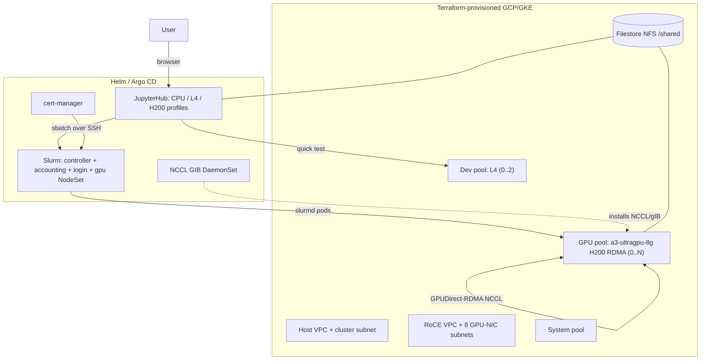

# GKE + Slinky Slurm GPU Training Platform with JupyterLab

A reproducible, mostly one-touch platform for **multi-node training of
VRAM-intensive models** on Google Kubernetes Engine:

- **Terraform** provisions a regional GKE cluster, the GPU **RDMA (RoCE)**
  networking fabric, autoscaling node pools (H200/B200 + cheap L4 dev pool), and
  shared Filestore storage.
- **Slinky (Slurm-on-Kubernetes)** by SchedMD/NVIDIA runs the batch scheduler
  (`sbatch`/`srun`/`squeue`) over **GPUDirect-RDMA** for line-rate NCCL.
- **JupyterHub** gives a dev environment to prototype on a cheap L4 and then
  submit full jobs to the Slurm cluster (shared NFS home, SSH-based submit).
- **Helm + a Makefile** for first bring-up; **Argo CD** app-of-apps available
  for steady-state GitOps.

## Architecture



## Prerequisites

- `gcloud`, `kubectl`, `helm` (v3.5+), `terraform` (>= 1.6), `docker`, `envsubst`.
- A GCP project with billing and **H200/B200 capacity** — almost always a
  **reservation** (set `gpu_capacity_mode = "reservation"` + `reservation_name`).
  DWS flex-start and Spot are also supported via `gpu_capacity_mode`.
- Quota for the chosen accelerator in your `zone`.

## Quickstart

```bash
cd terraform
cp terraform.tfvars.example terraform.tfvars   # edit project_id, zone, reservation_name, ...
cd ..

make infra      # GKE + RDMA VPCs + node pools + Filestore
make creds      # kubectl context
make images     # build/push slurmd + jupyter images to Artifact Registry
make bootstrap  # GKE Network objects + NCCL GIB DaemonSet + cert-manager + JobSet
make nccl-test  # OPTIONAL but recommended: prove the RDMA fabric (needs 2 GPU nodes)
make slurm      # Slinky operator + Slurm cluster
make jupyter    # JupyterHub (prints an SSH public key to add to slurm values)
make observability
```

`make all` runs the whole chain. `make help` lists every target.

> After `make jupyter-ssh-key` prints the public key, paste it into
> `loginsets.slinky.rootSshAuthorizedKeys` in `slurm/slurm-values.yaml.tmpl` and
> re-run `make slurm` so notebooks can submit jobs to the login node.

## Day-to-day workflow

1. Open JupyterHub: `kubectl -n slurm port-forward svc/proxy-public 8000:80` -> http://localhost:8000
2. Spawn the **GPU dev - 1x L4** profile and iterate in
   `examples/notebook-quicktest.ipynb`.
3. When ready, submit the real job (runs on H200 over RDMA):
   ```bash
   sbatch ~/sbatch-2node-ddp.sh   # from a notebook terminal; or from the login pod
   squeue
   ```
4. The GPU pool autoscales up for the job and back to zero afterwards.

## Repo layout

| Path | What |
| --- | --- |
| `terraform/` | GKE cluster, RoCE VPC + 8 subnets, node pools, Filestore, Artifact Registry |
| `bootstrap/` | GKE multi-network objects, NCCL GIB installer, cert-manager values |
| `slurm/` | slurm-operator values, Slurm cluster values, custom `slurmd` image |
| `jupyter/` | z2jh values + JupyterLab image (SSH submit wrappers) |
| `observability/` | DCGM (managed) + Slurm PodMonitoring + optional Grafana |
| `argocd/` | Optional app-of-apps GitOps overlay |
| `examples/` | NCCL RDMA test, 2-node DDP sbatch job, quick-test notebook |

## Hardware / capacity notes

- Default: **A3 Ultra** (`a3-ultragpu-8g`, 8x H200 141 GB). Switch to **A4**
  (`a4-highgpu-8g`, B200) by setting `gpu_machine_type` + `gpu_accelerator_type`
  in `terraform.tfvars` and `gvnic/rdma_network_prefix` to `a4high-*`.
- GPUDirect-RDMA requires Container-Optimized OS, `gpu-driver-version=latest`,
  and uses **one pod per node** (all 8 GPUs + all 8 RDMA NICs).
- For B200 update the `slurmd` image build args to a CUDA 12.8 / torch >= 2.7
  wheel (Blackwell `sm_100`).

## Cost control

- GPU pool scales to **zero**; do interactive work on the L4 pool.
- Idle notebooks are culled after 1h.
- H200/B200 nodes are expensive while running — keep `GPU_NODESET_REPLICAS`
  and `gpu_max_nodes` tight, and scale down when idle.

## Gotchas / things to verify on your cluster

- Pin Helm chart versions you tested (`slurm`, `slurm-operator`, `cert-manager`,
  `jupyterhub`) — see `argocd/apps/*` and the Makefile.
- Slurm chart field names evolve; cross-check against
  `helm show values oci://ghcr.io/slinkyproject/charts/slurm`.
- If NCCL test pods stay `SchedulingGated`, remove the `schedulingGates` block in
  `examples/nccl-test.yaml`.
- Do **not** combine the GKE DRANET driver with the multi-network API used here.
