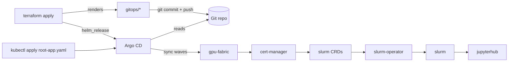

# GitOps (Argo CD primary)

Argo CD is the primary deployment path. **Terraform renders every dynamic
manifest here and installs Argo CD**; you commit `gitops/` and Argo reconciles
the platform. Nothing in here is hand-edited.

## Layout

| Path | Source | What |
| --- | --- | --- |
| `bootstrap/project.yaml` | Terraform | Argo `AppProject` (allowed repos/dests) |
| `bootstrap/appset.yaml` | Terraform | `ApplicationSet` -> cert-manager, slurm CRDs/operator/cluster, JupyterHub |
| `bootstrap/fabric-app.yaml` | Terraform | `Application` for the GPU fabric (wave -1) |
| `fabric/nccl-rdma-installer.yaml` | vendored | NCCL/GIB RDMA DaemonSet (pinned) |
| `fabric/gke-network-objects.yaml` | Terraform | `gvnic-1` + `rdma-0..7` Network objects |
| `rendered/slurm-values.yaml` | Terraform | Slurm Helm values (image, GRES, NFS IP, RDMA) |
| `rendered/jupyter-values.yaml` | Terraform | JupyterHub Helm values |
| `root-app.yaml` | Terraform | App-of-apps that points Argo at `bootstrap/` |

Static values referenced by the ApplicationSet live next to their component:
`bootstrap/cert-manager-values.yaml` and `slurm/operator-values.yaml`.

## Flow



## Bootstrap

```bash
make infra        # provisions GKE, installs Argo CD, renders gitops/
make images       # build/push slurmd + jupyter images
make gitops       # commit gitops/ + apply gitops/root-app.yaml
# Argo admin password:
kubectl -n argocd get secret argocd-initial-admin-secret -o jsonpath='{.data.password}' | base64 -d
```

After that, every change flows through Git: edit `terraform.tfvars` ->
`terraform apply` -> commit `gitops/` -> Argo syncs. Drift is auto-healed.

## Notes

- OCI chart registries (ghcr/quay) and the git repo are registered with Argo
  declaratively via `configs.repositories` in `terraform/gitops.tf`. If your
  git repo is **private**, add a PAT or SSH key to that `gitops` entry.
- Slurm's auth secrets (`slurm-auth-slurm`, `slurm-auth-jwt`) are pre-created by
  `make gitops` because the chart's `lookup`+`randAscii` generation breaks under
  Argo's `helm template` rendering (values set `slurmKey.create: false`).
- Slurm accounting is disabled by default (the chart bundles no database); the
  enable path is documented in `terraform/templates/slurm-values.yaml.tftpl`.
- The Helm-first path still works for ad-hoc use: `make bootstrap && make slurm
  && make jupyter` consume the same `gitops/rendered/*` value files.
